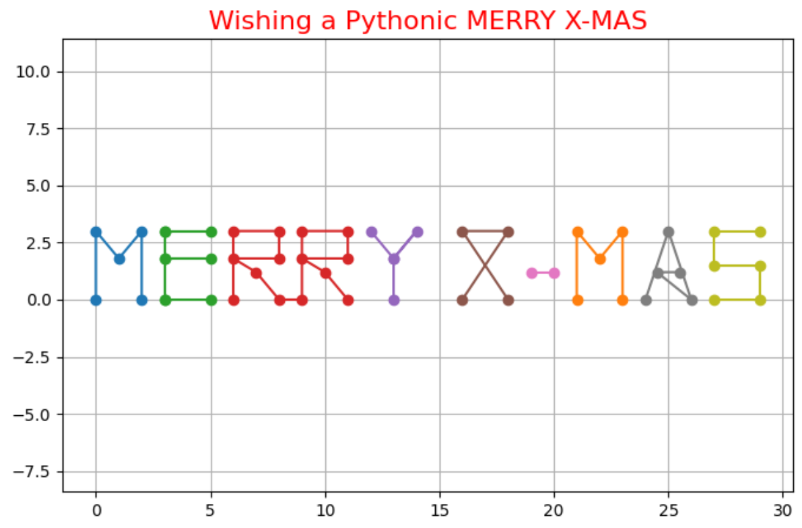

# 🎄 MERRY X-MAS Visualization with Python

Bring the holiday spirit to your Python projects with this Christmas-themed visualization! This project reads coordinate data from a CSV file and plots a festive "MERRY X-MAS" message using Matplotlib.

---

## ✨ Features
- **Custom Letter Drawing**: Visualizes individual letters based on (X, Y) coordinate data.
- **Festive Design**: Includes colorful markers and holiday-themed aesthetics.
- **Dynamic Dataset Support**: Easily modify the `merry_xmas.csv` file to create custom messages or shapes.
- **Scalable Plot**: Adjusts the visualization dynamically to fit within the canvas.

---

## 🎁 How It Works
1. **Input Data**: A CSV file containing:
   - `Letter`: The character associated with the coordinates.
   - `X` and `Y`: Coordinates for plotting.
   - Rows with missing values indicate breaks (pen-up moments) for disconnected parts of the letter.

2. **Drawing Logic**:
   - Groups data by `Letter`.
   - Draws continuous segments of each letter while handling gaps (pen-up moments).
   - Plots the results with festive markers and a holiday-themed grid.

---

## 📁 File Structure
```
📂 merry-xmas-visualization
├── README.md               # Project documentation
├── merry_xmas.csv          # CSV file with letter coordinates
├── main.py                 # Python script for visualization
└── requirements.txt        # Python dependencies
```

---

## 🔧 Getting Started

### Prerequisites
Make sure you have Python installed. You'll also need the following Python libraries:

- `pandas`
- `matplotlib`

You can install these libraries using the following command:

```bash
pip install -r requirements.txt
```

### Running the Project
1. Clone this repository:
   ```bash
   git clone https://github.com/yourusername/merry-xmas-visualization.git
   cd merry-xmas-visualization
   ```
2. Prepare the `merry_xmas.csv` file with your custom coordinates (or use the provided example).
3. Run the script:
   ```bash
   python main.py
   ```

---

## 🎨 Example Output
The script generates a visualization like this:



---

## 🎅 Contributing
Feel free to:
- Submit pull requests for enhancements or bug fixes.
- Create issues for feature requests or suggestions.
- Share your own custom designs using this project!

---

## 📜 License
This project is licensed under the MIT License. See the [LICENSE](LICENSE) file for details.

---

## 🌟 Acknowledgments
This project was inspired by the holiday spirit and the joy of coding. Special thanks to the Python community for making such creative projects possible!

---
